# User Sentiment Tracking System - Component Briefs

## 2.2.2 Login Page

### Overview

The Login Page serves as the secure entry point to the User Sentiment Tracking System, implementing role-based authentication to ensure appropriate access control across different user types.

### Key Features

- **Secure Authentication**: Username/password validation with encrypted password storage using bcrypt hashing
- **Role-Based Access**: Automatic permission assignment based on user roles (Administrator, Product Manager, Marketing Team)
- **Session Management**: Secure session handling with automatic logout functionality
- **Demo Credentials**: Pre-configured demo accounts for immediate system testing

### User Interface Elements

```
📊 User Sentiment Tracking System - Login
┌─────────────────────────────────────┐
│ Username: [________________]        │
│ Password: [________________]        │
│           [    Login    ]           │
└─────────────────────────────────────┘

Demo Credentials:
• Admin: admin / admin123
• Product Manager: product_manager / pm123
• Marketing Team: marketing_team / marketing123
```

### Technical Implementation

- Built using Streamlit's form components for secure input handling
- Integration with SQLite database for user credential storage
- Real-time validation and error messaging
- Activity logging for security auditing

### Security Features

- Password hashing with bcrypt encryption
- Session state management
- Failed login attempt monitoring
- Secure logout with session cleanup

---

## 2.2.3 Admin Page

### Overview

The Admin Page provides comprehensive system administration capabilities, enabling administrators to manage datasets, users, and monitor system health while maintaining full oversight of the sentiment tracking platform.

### Core Functionalities

#### 1. System Health Dashboard

- **Real-time Metrics**: User count, feedback volume, system status, uptime monitoring
- **Performance Indicators**: Visual dashboard with key system metrics
- **Health Monitoring**: Automated system health logging and status tracking

#### 2. Dataset Management

- **Upload Interface**: Drag-and-drop CSV file upload with format validation
- **Data Cleaning Pipeline**: Automated text preprocessing and data quality checks
- **Column Mapping**: Interactive interface for mapping text and sentiment columns
- **Preview & Validation**: Real-time dataset preview with statistical summaries

#### 3. Model Training & Management

- **Automated Training**: Machine learning model training on uploaded datasets
- **Performance Analytics**: Model accuracy assessment with detailed metrics
- **Version Control**: Model versioning with timestamp-based storage
- **Quality Assurance**: Performance recommendations and data balance analysis

#### 4. User Activity Monitoring

- **Activity Logs**: Real-time user action tracking and audit trails
- **Usage Analytics**: User engagement metrics and system utilization
- **Security Monitoring**: Login/logout tracking and access pattern analysis

### Technical Architecture

```python
# Key Admin Functions
def show_admin_panel():
    - System health monitoring
    - Dataset upload & processing
    - Model training pipeline
    - User activity analytics
    - Database management
```

### Data Flow Process

1. **Upload** → Dataset validation and format checking
2. **Clean** → Text preprocessing and data quality improvement
3. **Train** → Machine learning model creation and validation
4. **Deploy** → Model deployment and system integration
5. **Monitor** → Performance tracking and health monitoring

---

## 2.2.3 Dashboard (General Dashboard)

### Overview

The General Dashboard serves as the universal interface accessible to all authenticated users, providing essential sentiment analysis visualizations and basic system functionality regardless of role permissions.

### Core Features

#### 1. Dataset Selection & Management

- **File Browser**: Dynamic dropdown for available datasets
- **Refresh Capability**: Real-time dataset list updates
- **Multi-format Support**: CSV file handling with automatic column detection

#### 2. Basic Sentiment Visualization

- **Distribution Charts**: Bar charts showing sentiment category breakdown
- **Summary Statistics**: Key metrics and data overview
- **Interactive Plots**: Matplotlib and Plotly-powered visualizations

#### 3. User Interface Elements

```
🎯 User Sentiment Tracking System
Welcome, [username] ([role])

Navigation Sidebar:
├── 📋 General Dashboard
├── 🔧 Admin Panel (if authorized)
├── 📈 Product Analytics (if authorized)
└── 📊 Marketing Analytics (if authorized)

Main Content Area:
├── Dataset Selection
├── Sentiment Distribution
├── Basic Analytics
└── Export Options
```

#### 4. Permission-Based Features

- **Role Adaptation**: Interface elements adjust based on user permissions
- **Access Control**: Seamless hiding/showing of restricted features
- **Navigation Logic**: Dynamic menu generation based on user role

### Technical Implementation

- Streamlit-based responsive interface
- Real-time data loading and processing
- Interactive visualization with matplotlib/plotly
- Session state management for user preferences

---

## 2.2.4 Product Manager Dashboard

### Overview

The Product Manager Dashboard provides specialized tools for product-focused sentiment analysis, root cause identification, and actionable business intelligence to improve product performance and customer satisfaction.

### Advanced Analytics Features

#### 1. Sentiment Alert System

- **Threshold Monitoring**: Automated alerts when negative sentiment exceeds 30%
- **Real-time Status**: Health indicators with color-coded warnings
- **Product Filtering**: Individual product analysis and comparison

#### 2. Root Cause Analysis Engine

```
🔍 Root Cause Analysis Pipeline:
┌─────────────────────────────────────┐
│ 1. Negative Sentiment Detection     │
│ 2. Temporal Trend Analysis          │
│ 3. Keyword Category Classification  │
│ 4. Issue Priority Ranking           │
│ 5. Actionable Recommendations       │
└─────────────────────────────────────┘
```

#### 3. Issue Categorization System

- **Quality Issues**: Defects, durability, manufacturing problems
- **Shipping/Delivery**: Logistics, timing, packaging concerns
- **Customer Service**: Support quality, response times, staff behavior
- **Price/Value**: Cost concerns, value perception, competitive pricing
- **Functionality**: Performance, usability, technical problems

#### 4. Trend Analysis & Visualization

- **Time-based Charts**: Negative sentiment trends over time
- **Keyword Analysis**: Most frequent issue mentions
- **Sample Feedback**: Contextual examples of negative feedback
- **Performance Metrics**: Visual breakdown of issue categories

#### 5. Automated Recommendations

```python
# Recommendation Engine
recommendations = {
    'Quality Issues': [
        "🔧 Review manufacturing processes",
        "📊 Conduct focus group testing",
        "🏭 Audit supplier standards"
    ],
    # ... additional categories
}
```

#### 6. PDF Report Generation

- **Automated Reports**: One-click PDF generation with comprehensive analysis
- **Download Integration**: Direct download functionality
- **Customizable Content**: Product-specific report formatting

### Decision Support Features

- **Priority Matrix**: Issue ranking by frequency and impact
- **Action Planning**: Specific recommendations for each issue category
- **Performance Tracking**: Before/after analysis capabilities

---

## 2.2.5 Marketing Team Page

### Overview

The Marketing Team Page focuses on brand sentiment monitoring, campaign performance analysis, and cross-platform sentiment tracking to support marketing strategy and brand management initiatives.

### Core Marketing Analytics

#### 1. Campaign Performance Monitoring

- **Campaign Selection**: Multi-campaign analysis interface
- **Performance Metrics**: Reach, engagement, sentiment distribution
- **Trend Tracking**: Campaign effectiveness over time
- **ROI Analysis**: Sentiment-based campaign success measurement

#### 2. Brand Sentiment Analysis

- **Cross-Platform Monitoring**: Multi-channel sentiment aggregation
- **Brand Health Scores**: Overall sentiment indicators
- **Competitive Analysis**: Comparative brand performance
- **Geographic Sentiment**: Location-based sentiment mapping

#### 3. Marketing Intelligence Dashboard

```
📊 Marketing Dashboard Interface:
┌─────────────────────────────────────┐
│ Campaign: [Summer Sale 2025 ▼]      │
│ ┌─────────┬─────────┬─────────┐      │
│ │ Reach   │ Pos.    │ Engage. │      │
│ │ 10,234  │ 1,456   │ 5.2%    │      │
│ └─────────┴─────────┴─────────┘      │
│                                     │
│ [Generate Campaign Report]          │
└─────────────────────────────────────┘
```

#### 4. Report Generation Capabilities

- **Campaign Reports**: Automated PDF generation for campaign analysis
- **Brand Health Reports**: Comprehensive brand sentiment documentation
- **Marketing Insights**: Actionable recommendations for campaign optimization
- **Export Functionality**: Data export for external analysis tools

#### 5. Content Strategy Support

- **Sentiment-Based Content**: Content recommendations based on audience sentiment
- **Message Optimization**: Feedback-driven communication strategy
- **Audience Insights**: Demographic and psychographic sentiment analysis
- **Crisis Management**: Rapid response to negative sentiment trends

---

## 2.3 Logic Model

### Overview

The Logic Model represents the systematic flow of data, processes, and decision-making within the User Sentiment Tracking System, illustrating how inputs are transformed into actionable business intelligence through structured workflows and data relationships.

## 2.3.1 Flow Chart

### System Process Flow


### Data Processing Pipeline Flow

```mermaid
flowchart LR
    subgraph Input ["🔄 INPUT LAYER"]
        A1[CSV Files]
        A2[User Reviews]
        A3[Platform Data]
        A4[Campaign Data]
    end

    subgraph Process ["⚙️ PROCESSING LAYER"]
        B1[Data Validation]
        B2[Text Cleaning]
        B3[Feature Extraction]
        B4[ML Classification]
        B5[Sentiment Analysis]
        B6[Pattern Recognition]
    end

    subgraph Output ["📊 OUTPUT LAYER"]
        C1[Visualizations]
        C2[Reports]
        C3[Alerts]
        C4[Recommendations]
        C5[Dashboards]
    end

    Input --> Process
    Process --> Output

    A1 --> B1
    A2 --> B1
    A3 --> B1
    A4 --> B1

    B1 --> B2
    B2 --> B3
    B3 --> B4
    B4 --> B5
    B5 --> B6

    B6 --> C1
    B6 --> C2
    B6 --> C3
    B6 --> C4
    B6 --> C5
```



### Decision Logic Flow


## 2.3.2 Use Case Diagram


### Use Case Descriptions

#### Administrator Use Cases

- **UC2 - Manage Users**: Create, modify, and delete user accounts with role assignments
- **UC3 - Upload Dataset**: Import CSV files and validate data format and quality
- **UC4 - Train ML Model**: Execute machine learning pipeline for sentiment classification
- **UC5 - Monitor System Health**: Track system performance metrics and uptime
- **UC6 - Generate Audit Reports**: Create comprehensive system usage and security reports

#### Product Manager Use Cases

- **UC7 - Analyze Product Sentiment**: Examine sentiment trends for specific products
- **UC8 - Root Cause Analysis**: Identify underlying issues in negative feedback
- **UC10 - Monitor Sentiment Alerts**: Receive notifications for sentiment threshold breaches
- **UC11 - Track Product Performance**: Monitor product health over time

#### Marketing Team Use Cases

- **UC12 - Monitor Brand Sentiment**: Track overall brand perception across platforms
- **UC13 - Analyze Campaign Performance**: Evaluate marketing campaign effectiveness
- **UC15 - Cross-Platform Analytics**: Compare sentiment across different channels
- **UC16 - Competitive Analysis**: Benchmark against competitor sentiment

## 2.3.3 ERD Diagram


### Database Schema Details

#### Core Entities

**Users Table**

- Stores user authentication and profile information
- Role-based permissions (admin, product_manager, marketing_team)
- Activity tracking with login timestamps

**Feedback Table**

- Central repository for all sentiment data
- Links to users, products, and campaigns
- Includes ML confidence scores and model versions

**Products Table**

- Product catalog with categorization
- Supports product-specific sentiment analysis
- Maintains product lifecycle status

**Campaigns Table**

- Marketing campaign management
- Campaign-specific sentiment tracking
- Budget and timeline information

#### Supporting Entities

**Sentiment Models Table**

- Version control for ML models
- Performance metrics tracking
- Model artifact file paths

**System Health Table**

- Real-time system monitoring
- Performance metrics storage
- Status tracking and alerting

**User Activity Table**

- Comprehensive audit trail
- Security monitoring and analysis
- User behavior tracking

**Alerts Table**

- Automated notification system
- Severity-based categorization
- Resolution tracking

**Reports Table**

- Generated report management
- Parameterized report storage
- Multi-format export support

### Data Relationships

1. **One-to-Many Relationships**

   - Users → Feedback (user creates multiple feedback entries)
   - Products → Feedback (product receives multiple reviews)
   - Users → Reports (user generates multiple reports)

2. **Many-to-One Relationships**

   - Feedback → Models (feedback classified by one model version)
   - Alerts → Products (multiple alerts can relate to one product)

3. **Optional Relationships**
   - Feedback → Campaigns (feedback may or may not be campaign-related)
   - Reports → Products/Campaigns (reports can be general or specific)

This comprehensive logic model ensures data integrity, supports complex analytics, and enables scalable sentiment analysis operations across all system components.
